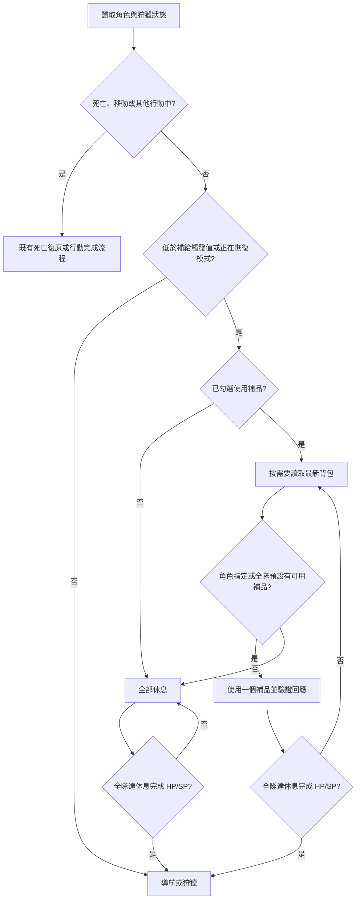

# 自動補品與休息設計

## 目標

自動狩獵只對遊戲內勾選出戰的角色使用恢復補品。角色低於補給觸發值時進入恢復模式；補品或休息會讓全隊恢復到設定的休息完成 HP／SP 後，才恢復狩獵。

預設值：HP 補給觸發 80%、SP 補給觸發 70%、休息完成 HP 90%、休息完成 SP 90%。

## API

| 操作 | API |
| --- | --- |
| 讀取背包道具與礦石 | `GET /api/items` |
| 讀取裝備 | `GET /api/equipments` |
| 使用補品 | `POST /api/items/{itemId}/use`，內容為 `{ "quantity": 1, "heroId": 角色 ID }` |

使用道具成功後，回應中的 `items` 與 `hero` 是庫存與角色數值的驗證來源。

## 可用補品規則

只有符合全部條件的道具才會出現在補品選單或被自動使用：

1. 來自 `items`，不是 `mines`。
2. `target` 為 `hero`。
3. 有 `healHp > 0` 或 `healSp > 0`。
4. `available` 不是 `false`，且庫存大於 0。
5. 沒有 `effectTexts` 與 `effectDurationSec`。

能力增益、效率、攻擊、幸運、限時效果、裝備、礦物、材料與無恢復效果的道具一律排除。

## 設定

### 自動狩獵設定

| 設定 | 用途 |
| --- | --- |
| HP／SP 補給觸發值 | 低於任一值時開始恢復模式。 |
| 休息完成 HP／SP | 補品與休息的共同完成目標；全隊出戰角色都達標才繼續狩獵。 |
| 使用補品 | 獨立勾選。未勾選時，進入恢復模式後直接休息。 |

休息完成值不得低於對應補給觸發值。

### 補品設定

每個帳號提供全隊預設 HP、SP、雙恢復補品；每個角色也可分別指定 HP、SP、雙恢復補品。

選擇順序：

1. 角色指定補品。
2. 角色指定補品未設定、用完、不可用或不符合安全規則時，改用全隊預設補品。
3. 兩者都不可用時，進入休息。

不保留庫存。補品達到恢復條件前會依每次一個的 API 請求持續補充；每筆請求都先驗證回應中的庫存已減少、HP 或 SP 已增加。

## 自動流程

## 背包讀取與網頁資源

不做固定背景輪詢。背包資料只會在下列時機讀取：

1. 使用者按下「讀取補品」。
2. 自動流程進入恢復模式，且背包資料不存在或超過 15 秒。
3. 使用補品後，直接採用 API 回應中的最新 `items`。

畫面會顯示可用補品數量與上次讀取時間。新增道具後可按「讀取補品」立即更新；即使沒有手動讀取，下一次實際進入恢復模式也會重新向遊戲 API 取得背包。

## 訊息與操作紀錄

流程訊息要區分原因：

- 未設定適用補品，已自動進入休息。
- 指定補品用完，改用全隊預設補品。
- 適用補品已用完，已自動進入休息。
- 設定補品不符合安全規則，已自動進入休息。
- 補品恢復完成，全隊達到 HP／SP 目標。
- 休息尚未達成目標，繼續休息。

操作紀錄保留 API 請求、回應、道具名稱與 ID、角色 ID、使用前後 HP／SP、使用前後庫存，以及是否由角色指定切換到全隊預設。Token、Cookie、Headers 與密碼不記錄。

## 驗收情境

1. 未勾選使用補品時，低於觸發值後直接休息至 90%。
2. 有角色指定補品時，先使用指定補品至 90%。
3. 指定補品用完時，正確切換全隊預設補品。
4. 所有適用補品不足時，提示原因並進入休息。
5. 能力增益道具不會出現在選單，也不會發送使用 API。
6. 道具新增後按「讀取補品」可直接出現；不用重新錄製 API。
